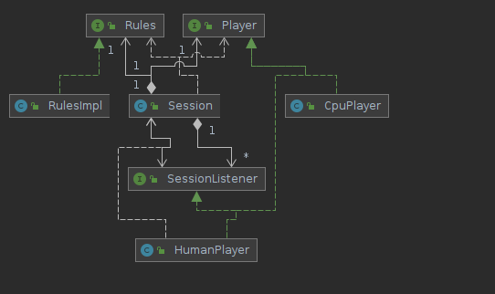
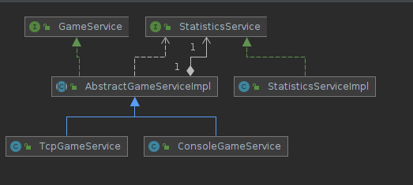

# rock-paper-scissors game

Implementation of game "Paper-Rock-Scissors" for production deployments.


## User flow

Basic user flow:

* User access application over terminal or TCP connection;
* User enter number of games to play;
* For each game user enter ROOK, PAPER or SCISSORS, see opponent response and game result;
* After enting of all games user see termination message;

# Architecture

Since requirement is to have production application was decided to create a solution based on next technology stack:

* Java 16 - modern language with a lot of useful libraries;
* Spring Boot - to get dependency injection, configuration management, runtime metrics exporting and posibilities to extend in future;
* Gradle - build tool which focus on usabilitiy and extensibility;
* Apache Commons - common set of libraries which handle operations with strings, input streams;
* javatuples - library which provide Pairs, Tuples;
* Lombok - library which help to reduce generated code;
* Micrometer - library for metrics store;
* Docker - software to package applications in containers;
* Kubernetes - software to orchestrate containers deployment;
* Kustomize - Kubernetes native configuration management;

To ensure code quality, during building of artifacts are used libraries and  approaches to track quality state:

* JUnit - library to write unit test;
* Mockito - library to generate mocks for existing code;
* Hamcrest - advanced assertions library;
* Jacoco - plugin to Gradle used to generate reports with code coverage

Note:
* In order to access appliation deployed on multiple servers, was introduced additional interface over TCP, plain text communication;


## Game rules

Game rules implementation is in class `com.game.prs.game.RulesImpl` which implements `Rules` interface, decoupling in `impl` and interface was introduced to add posibility for future extension - for example adding new rules.

## Data model

To model application flow were introduced multiple model classes(package `com.game.prs.model`):
* PlayerChoice - enum with possible user inputs
* SessionState - state of game session: in progress, finished etc.
* WinResult - one game result(PLAYER1 value - represent that player1 won);

## Game session

State of one game is saved in `com.game.prs.game.Session` which contains instance of rules, state of game, players.

State of Session instance is update on each invocation of `update()` method.

To allow future extensibility, is used approach subsribers and events generated from Session during state update - this allow to add for example to each game session listener which will count statistics accross parallel games.

## Players

Game players are represented through `HumanPlayer` `CpuPlayer`, both instances implement `Player` interface

* HumanPlayer - represent  inputs obtained from player, instance constructed with input/output streams, also it is subscribed for session events and prints to output updates;
* CpuPlayer - represent opponent in game, currenty it is generating randomly one of `PlayerChoice` response

Players can be extended with other implementations for example with more advanced logic for `CpuPlayer`




## Game session management

Game sessions are created and managed by `ConsoleGameService` and/or `TcpGameService`:
* ConsoleGameService - handle interaction from terminal;
* TcpGameService - handle requests over TCP;

Both classes inherit common code from `AbstractGameServiceImpl` for session creation.




For counting game related statistics, is used `StatisticsService` which is subscribed to all game sessions and provide collected metrics as Prometheus counters.

## Configurations

Application configurations are stored in `application.yaml` file and allow to configure application services:
* enable/disable services which accept players over console/tcp;
* configure number of parallel players;
* change exposed ports;

## Internationalization and localization

To allow future extensions to other markets, all messages generated by application were extracted as constants in class `com.game.prs.I18N` and in future can be updated to contain translations in different languages.


# Project structure

Structure of default Java project:
* src/main/* - main application source code and configuration files;
* src/test/* - application test code;
* kubernetes - Kubernetes resources to deploy application;

# Local build

To build project locally, run:

```
./gradlew clean build
```

To start project locally, run:

```
java -jar ./build/libs/prs-0.0.1-SNAPSHOT.jar
```

Note: application can be also started through gradle task `./gradlew bootRun` but terminal interation will not be available.


# Container build

To build applicaton container, run `build_docker.sh` it will automatically build and tag container based on git hash.


Run container application:
```
docker run -it -p 8080:8080 -p 6969:6969 denis256/paper-rock-scissors:latest
```

# Kubernetes deployment

Prerequisite: running K8S cluster, kubectl configured to access cluster.

Deployment of Kustomize resources:
```
kubectl -n <deployment-namespace> apply -k kubernetes

configmap/app-config-xxx created
service/game-service created
deployment.apps/paper-rock-scissors created
```

Check status of pods:
```
kubectl -n <deployment-namespace> get pods 
```

# Accessing application
* over terminal
* over tcp, with telnet `telnet localhost 6969`
* over http, to get metrics/health status http://localhost:8080/actuator/prometheus http://localhost:8080/actuator/health
* in case of Kubernetes deployments, can be used NodePort ``


# Future work

List of future improvements:
* separation of integration tests as separated module and execution against fully started application;
* asyncronous handling of users by using Nio servers, like Netty;
* usage of IMGD(like Apache Geode, Hazelcast) for saving game session and restoring it on other node;
* saving of statistics from each application in one common place;
* CI/CD pipeline for automated test execution and monitoring of code quality;
* service monitors configuration for Prometheus and Grafana dashboards to show status of applications;


# License

Only for reference, distribution and/or commercial usage not allowed
